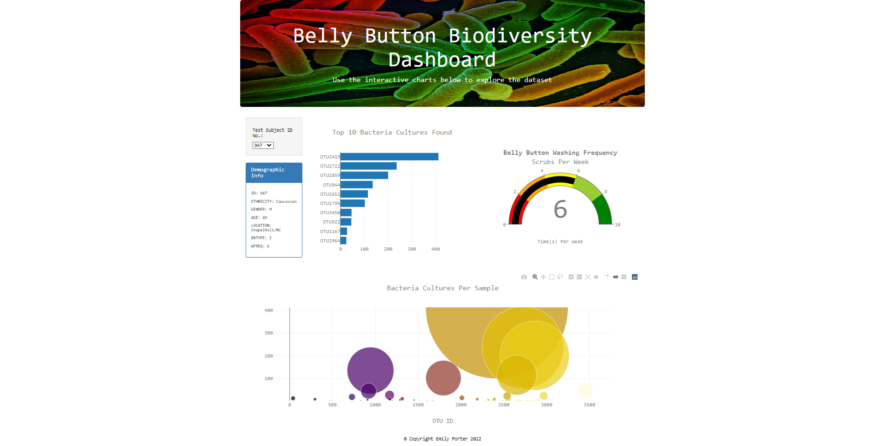
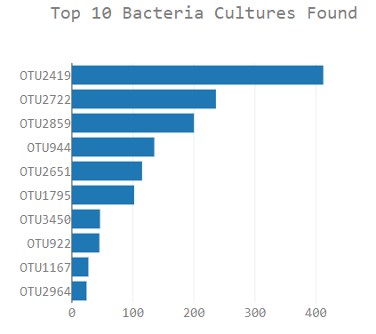
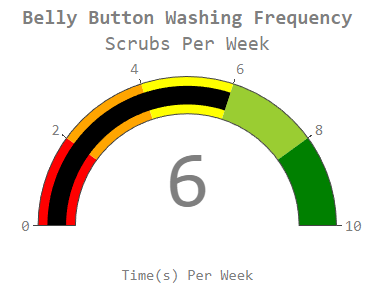
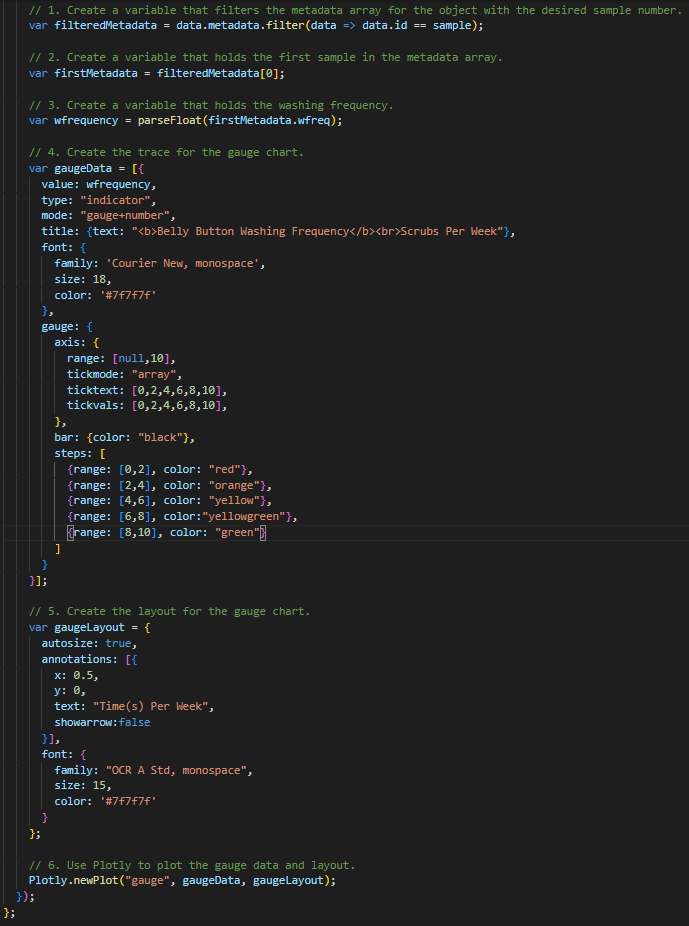
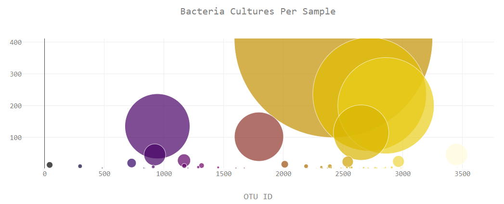

# Plotly Belly Button Biodiversity
* To access my project please click <a href="https://emilyporter920.github.io/Plotly-Bellybutton-Biodiversity/" target="_blank">here</a>.

## Overview
* This site was created to give users the ability to search the large dataset of test subjects, see visuals of the different types of bacteria, and compare the types and number of bacteria to the weekly frequency of belly button washing.

## Website
* The website is shown below, however for more interactivity it is suggested to follow the hyper link provided above to the website.

    

### Charts and Examples of Code
* Below is a bar chart showing the top 10 bacteria cultures found in each test subject.

    

* Below is a gauge showing the weekly washing frequency of each test subject and the code used to create it.

    

    

* Below is a bubble chart that shows the types of bacteria found in each test subject with bubble size dependent on the amount found.

    

## Questions

* You can contact me via email or GitHub!

    * Email: emilyporter920@gmail.com
    * GitHub Profile: Emily Porter || github.com/emilyporter920 
